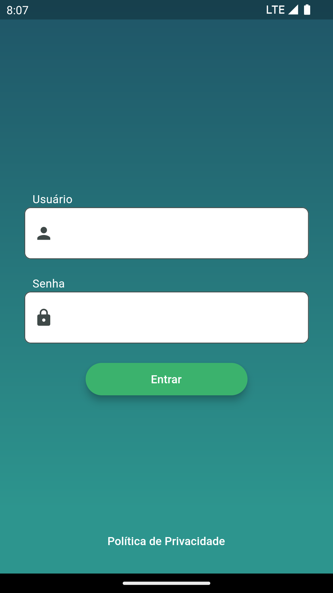
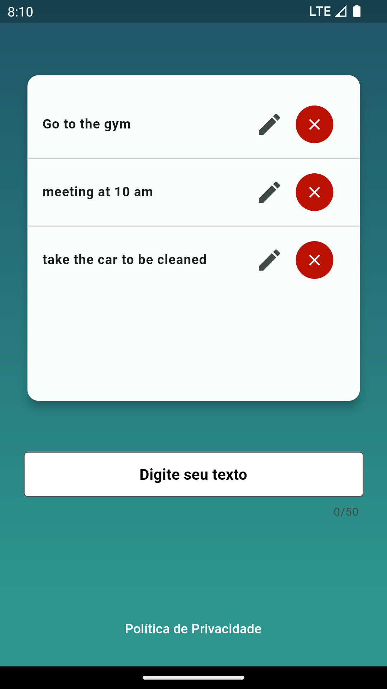

# PROVA FLUTTER
Faça um aplicativo em Flutter que atenda os requisitos aqui listados se aproximando o máximo
possível das imagens de exemplo.
## Tela de login
Uma tela de autenƟcação onde o usuário é obrigado a digitar seu login e senha.
### A tela deve conter
- Um Campo de senha
- Um campo de texto para representar o Login
- Um Label descrito "Política de privacidade"
### Como tela deve se comportar
- Verificar e alertar se ambos os campos de Login e senha estão preenchidos.
- O campo senha não pode ter menos que dois caracteres.
- O campo senha não pode ter caracteres especiais, sendo apenas possível
informar 'a' até 'Z' e '0' até '9'.
- Ambos os campos não podem ultrapassar 20 caracteres.
- Ambos os campos não podem terminar com o caractere de espaço no final.
- Se ambas as informações estiveram preenchidas deve ir para a próxima tela.
- Ao tocar no label "Política de privacidade" uma página web direcionada para o
google.com.br deve ser aberta.

**Observações**

*Não é necessário validar as informações em uma API Externa, mas caso seja feito um mockAPI
contara como um diferencial*
As apis externas apenas permitem o uso do get (mockAPI cobra pelos outros endpoints).
** Estou usando o ToDo do JsonPlaceholder **, não modifica o bd no servidor, mas pelos testes 
é possível ver que está fazendo o update e delete de dados.
### info_service_test.dart

## Tela de captura de informações
A tela deve salvar as informações digitadas pelo usuário em um card, listando essas informações
salvas e dando a opção de editar ou excluir. Essas informações não podem ser perdidas ao fechar
o app, ou seja, ao abrir a tela as informações salvas anteriormente devem ser mostradas na
ordem.
### A tela deve conter
- Um card principal e central
- Um campo de texto
### Como a tela deve se comportar
- O foco da digitação deve estar o tempo todo no campo de "Digite seu texto" e não pode
ser perdido ao interagir com a tela. 
**o foco o tempo todo no campo não ficou legal:** há comentários nas linhas 112 e 113 da info_page.dart 
- Ao acionar o "enter" o campo tem que verificar se a informação foi preenchida.
- O Card principal deve receber a informação digitada do campo.
- As informações precisam ser salvas e lidas uƟlizando a biblioteca shared_ preferences
(hƩps://pub.dev/packages/shared_preferences)
- O Icone de excluir deve abrir um pop-up confirmando a ação.
- Obrigatório a utilização do plugin MOBX para a construção da tela.

  
